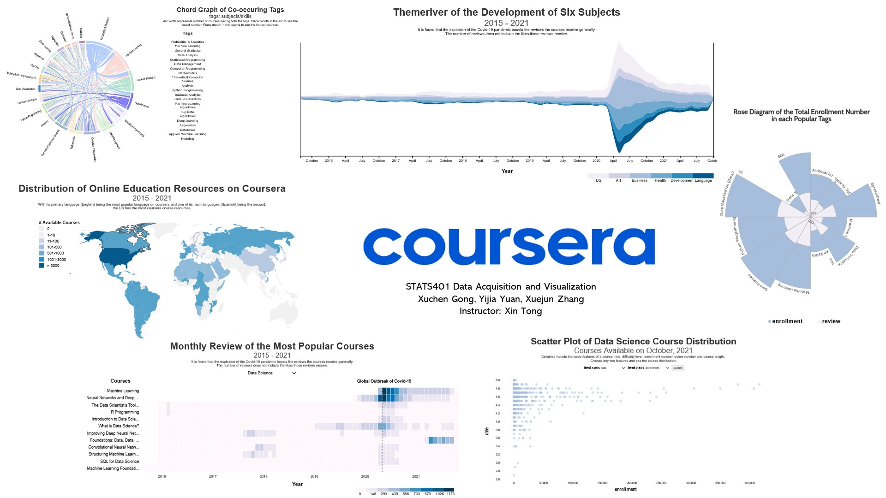

# Analysis of courses on coursera

## Introduction
Online education has the advantage of allowing students to participate in high-quality courses when distance and schedule make on-ground learning difficult. This advantage became obvious since the outbreak of the global pandemic Covid-19. Coursera is one of the biggest online course providers. It collaborates with more than 200 universities and companies and has more than 77 million users worldwide. This project researches the question of how courses on Coursera distribute and how has the pandemic influenced it. 

## Method
### Data Collection
The information of the courses is crawled directly from Coursera, and this process can be divided into two steps. In the first step, we use Octopus to extract the dictionaries of the Coursera courses of different subjects. The dictionaries contain the course titles, course links, the subject areas the courses belong to, the rating and teaching experience of the instructors, rating of the courses, the expected time to finish the courses, institutes, the tags of the courses, and the number of enrollments. In the second step, given a course’s link, we used Python to obtain the source code of a particular URL and then fetch the time of the reviews received for each course.  

After the extraction, we obtain the data of more than 2780 courses. There are 376 courses for art and humanities, 744 for business, 663 for data science, 621 for health, 213 for language learning, and 172 for personal development. 

### Data Pre-processing
For the ThemeRiver, based on the date of each review we retrieve, we calculate the increase of reviews in six fields on the monthly basis. In the heat map, we again group the reviews from the same month together and count its number for each selected course. 

For each course, the languages used to deliver the lectures or the available subtitles are crawled from the website. Since each language can be matched with a number of countries or areas that use this language as the official or main language, we establish a mapping from a language to a list of geological states. Finally, for the choropleth map, we map each geological state to a code that is used to match with the id of a country in the .geojson file. In the end, we find a total of 1788 courses offering English captions, 1247 courses offering Spanish captions, and 1218 courses offering Russian captions, etc.

For the chord diagram, a matrix is generated based on the common tags of two courses. For the scatter plot, empty and mismatched values are removed using Python to avoid influencing the overall distribution. 

## Visualizations

### Themeriver
This visualization investigates the increase of reviews in six fields: Data Science, Business, Health, Art and Humanity, Personal Development, and Language Learning, which can be differentiated by colors. The timeline is from Oct 2015 to Oct 2021. The width of each band denotes the increase of reviews in a specific field. It is shown that after the outbreak of Covid-19 in Feb 2020, there is a significant increase in the review number in all six fields, especially Data Science and Business which have involved large amounts of courses for years. The number of increases in reviews peaks in May 2020 and begins to stabilize in Jan 2021. It is hypothesized that staying at home prompts many people to pay attention to online education.

### Heat map
Aimed to visualize the difference in the number of reviews of different popular courses at different periods of time, this heat map provides users with a quick view of how the global outbreak of Covid-19 has changed the popularity of individual courses of different subjects.
More users have been drawn to online education platforms due to health concerns and limited access to in-person teaching. Moreover, introductory-level courses become increasingly popular, probably because people have a lot of free time at home and want to learn some skills. Public health courses also receive much more attention than before, with one course named “Covid19 Contact Tracing” quickly becoming one of the most popular courses in Coursera.

### Rose Diagram
In the rose diagram, we want to examine the most popular tags in Data Science by calculating enrollment numbers each hot tag involves. The length of the blue petals represents enrollment number, and the length of the pink petals represents review number. It can be found that among the most popular 12 tags in Data Science, Data Visualization (DataViz), Data Analysis, and Python Programming are of the greatest interest, each of which has attracted over 1 million users so far. It is speculated that Data Visualization receives great attention because of its extensive and flexible adaptation in different fields. Moreover, machine learning with over 0.9 million students follows, which is in line with the boom of AI. Moreover, the review number is generally proportional to the enrollment number as well.

### Map
This map aims to explore how online education resources are distributed around the world. With its primary language (English) and one of its main languages (Spanish) being the most popular languages on Coursera, the US has the most course resources. It is also indicated that the users from Russia, Canada, and South America also have plentiful subtitles in their favor. Moreover, generally, the English-speaking and Spanish-speaking countries have relatively more online academic resources compared with other countries, followed by Russian-speaking and Portuguese-speaking areas.

### Chord diagram
We are interested in finding out what pairs of tags co-occur most frequently in Data Science department, so we use the chord diagram to show the pair relationships. 21 of the hottest tags in Data Science are chosen and the chord arc represents the number of courses sharing the two tags. According to the graph, pairs of tags that co-occur frequently are (Probability, Analysis), (Machine Learning, Computer Programming), (Algorithm, Computer Science), (Data Visualization, Data Analysis), etc. These pairs are jointed offered in a large number of courses, indicating that the combined skills are very useful and should be learned together. For example, to be good in machine learning, one also needs to learn about computer programming; to be good at data visualization, one would definitely need the skills of data analysis.

### Scatter plot
In order to find out about some general course information and distribution, we use a scatter plot to answer the question “how are courses distributed with regards to basic features like rating, difficulty level, number of enrollment, number of reviews, required length”. There are 10 combinations of features and we can draw a conclusion for each graph. For example, this graph chooses enrollment and rating as the x-axis and y-axis. It indicates that the courses with the highest number of enrollment have high rating scores of above 4.7 while the courses with rating scores under 3.0 tend to have very few students enrolled.

